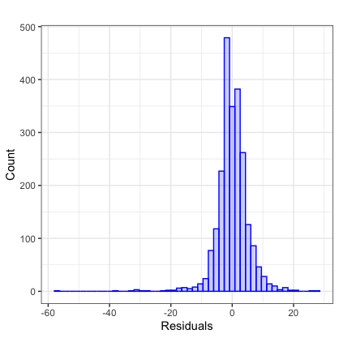

```{r setup, include=FALSE}
knitr::opts_chunk$set(echo = TRUE)
library(tidyverse)
library(knitr)
```


## Introduction

Hurricanes are type of storms with high speed winds that form over tropical or subtropical waters. Typically, hurricanes bring about strong winds, storm surges, and heavy rainfall that can lead to flooding, tornadoes, etc. The Saffir-Simpson Hurricane scale is used to rate hurricanes by their wind speed -- the higher the category, the greater the possibility of landfall damage. It is worthwhile to understand aspects of hurricanes and make accurate predictions in order to provide appropriate information and resources to the public, make informed decisions, and potentially save lives.

For this project, we have information about 356 hurricanes in the North Atlantic area since 1989, including the storm's location and maximum windspeed for every 6 hours. Additionally, the dataset includes information about season and month which hurricane occured, nature of the hurricane, and timing of the storm. We are interested in building a bayesian model in order to predict hurricane trajectories, particularly the wind speed at a specific time point. We will utilize Markov Chain Monte-Carlo to estimate the model parameters and their 95% credible intervals through the posterior distributions. Furthermore, we are interested in evaluating our model's ability to accurately predict windspeed and track the hurricanes.


## Methods 

### Bayesian and MCMC Basics

Unlike frequentist approaches, Bayesian analysis treats parameters as random variables and utilizes prior beliefs about the parameters. We start out with a prior distribution of the parameter of interest and then update it with observed data to obtain the posterior distribution. With the posterior distribution, we can obtain parameters estimates such as posterior mean. Bayes Theorem allows us to observe the relationship between prior distribution ($\pi(\theta)$), likelihood ($f(x|\theta)$), and posterior distribution ($\pi(\theta|x)$)

$$ \pi(\theta|x) = \cfrac{f(x|\theta) \pi(\theta)}{m(x)} = 
\cfrac{f(x|\theta) \pi(\theta)}{\int f(x|\theta) \pi(\theta) d\theta}$$

Obtaining the posterior distribution is often a difficult task -- either there is no closed form or it is computationally intensive to directly sample from $\pi(\theta|x)$. Therefore, MCMC is used to create a Markov chain of the parameter of interest such that their distribution converge to the posterior. A markov chain is a sequence of vectors $X_1, X_2,...,X_n$ such that the distribution of $X_{i+1}$ depends on only the recent past $X_{i}$. In the long run, the sequence generated will be drawn from a stationary distribution, which is the target distribution we want to sample from. The general steps for MCMC include 

1. Generate the next sequence for time $t_i$ from the proposal distribution: $\theta \sim q(\theta_i|\theta_{i-1})$

2. Calculate the ratio: $r(\theta_{new}, \theta_{i-1}) = \cfrac{\pi(\theta_{i-1})q(\theta_i|\theta_{i-1})}{\pi(\theta_{i})q(\theta_{i-1}|\theta_{i})}$

3. Find the acceptance probability: $$\alpha(\theta_{new}, \theta_{i-1}) = min[1, r(\theta_{new}, \theta_{i-1})]$$

4. Draw $u \sim uniform(0,1)$. If $u < \alpha(\theta_{new}, \theta_{i-1})$, then $\theta_{i} = \theta_{new}$. Otherwise $\theta_{i} = \theta_{i-1}$


There are two approaches to the MCMC algorithm: Gibbs sampling and Metropolis-Hastings. Gibbs sampling is a special case of Metropolis-Hastings when the probability of acceptance is 1. Gibbs sampling involves estimating the stationary distribution by samplling from conditional distributions of the parameters. In our case, since we do not have the conditional distributions of each parameter, we chose to use a Metropolis-Hastings algorithm.


### Hurricane Bayesian Model

The Bayesian model used to predict hurricane wind speeds can be expressed as follows:
$Y_i(t+6)=\mu_i(t)+\rho_iY_i(t)+\epsilon_i(t)$
where $\rho_j$ is the autoregressive correlation and the error $\epsilon_i$ follows the normal distribution with mean 0 and variance $\sigma^2$ independent across t. $\mu_i(t)$ represents the function mean that can be written as follows:
$$\mu_i(t) = \beta_0+\beta_1x_{i,1}(t)+\beta_2x_{i,2}(t)+\beta_3x_{i,3}(t)+\sum^3_{k=1}\beta_{3+k}\triangle_{i,k}(t-6)$$
where $x_{i,1}(t)$, $x_{i,2}(t)$, and $x_{i,3}(t)$ are the day of the year, calendar year, and type of hurricane at time t, respectively. 
and
$$\Delta_{i,k}(t-6) = Y_{i,k}(t) -Y_{i,k}(t-6),k=1,2,3$$
are the change of latitude, longitude, and wind speed
from time $t-6$ to $t$.
The following prior distributions were assumed:
$\pi(\boldsymbol{\beta})$ is jointly normal with mean 0 and variance $diag(1,p)$, $\pi(\rho_j)$ follows a truncated normal  $N_{[0,1]}(0.5, 1/5)$, and $\pi(\sigma^{-2})$ follows an inverse-gamma $(0.001, 0.001)$. 

### Metropolis-Hastings Algorithm

To estimate the parameters, a random walk Metropolis-Hastings (MH) algorithm with component wise updates was utiliized, with a uniform proposal for $\beta$ and $\rho$, and a inverse-gamma proposal for $\sigma^2$. The MH algorithm constructs a Markov chain by accepting candidate points with probability 
$$\alpha(y|x^{(t)})=min(1,\frac{\pi(y)q(x^{(t)}|y)}{\pi(x^{(t)})q(y|x^{(t)})})$$
The random-walk Metropolis is a special class where the proposed transition q is symmetric. As a result, the acceptance probability is only related to $\pi(y)$, i.e. prior distributions and the likelihood. The response wind speed was assumed to follow a normal distribution and the log-likelihood could be expressed as 
$$l(\beta, \rho)=-\frac{n}{2}log(2\pi)-nlog(\sigma)-\frac{1}{2\sigma^2}\sum^n_{i=1}(y-X^T\beta-\rho Y)^2$$
The partial posterior distribution can be formed by the product of the log-likelihood and the priors. For the MH algorithm, a burn in was incorporated to ensure analysis of a stationary distribution.

## Results

In order to test our predictions, we ran the MH algorithm on 80% of the hurricanes in our data, using 10,000 steps. We then explored the convergence plots in order to assure we achieved convergence and to choose a proper cut-off to consider as the burn-in steps. An example of such plots can be seen in Figure 1. Here we see a steady incline from 0 to around 2000 until it begins to fluctuate around 0.85. We therefore choose to use step 2000 as our burn-in and used steps 2001-10,000 to estimate our parameter distribution. The same was done for all parameters. 

Our final posterior means and their respective credible intervals (CI) can be found in Table 1. The CI are found by taking the 2.5th and 97.5th quantiles of the posterior distribution of each parameter. We see most of the intervals are narrow, an indication that the spread is small and only marginally fluctuates around the mean. Nature/type has the largest mean and widest CI (estimate: 17.14, CI: 11.24, 19.89), having a larger impact on our predictions. The means of the variables for the changes from time $t$ to $t + 6$ (i.e. latitude, longitude, windspeed) tend to be much smaller. This is in accord with intuition, we would not expect to see major changes in six hours time. Interestingly, difference in longitudinal mapping has a null effect on the predictions (estimate: 0.00, CI: -1.32, 0.72) while difference in latitudinal mapping has a large effect (estimate: 5.29, CI: 4.66, 5.82). It appears hurricanes' lattitude shift has more predictive ability on windspeeds.

To check how accurate our predictions were, we ran our model on the testing dataset (20% of the hurricanes). We found a root mean squared error of 40.13. To put this on the scale of wind speed, the mean wind speed is 48.06 (25th quantile = 30, 75th quantile = 60). Therefore this this is a large deviation from the true value. However, in Figure 2 we can see the distribution of these residuals. We find they are centered around zero, as we would like. The distribution is right skewed, causing this non-zero RMSE. Our model has a higher tendency to overpredict wind speed compared to under prediction.

We further explored our predictions by looking at the models ability to predict each hurricanes' wind speed longitudinally. Figure 3 shows how our model performed on four different hurricanes in our testing data set. For hurricanes Felix and Ike our model appears to perform well. The predicted wind speed is very close to the observed wind speed. There is no systematic under/over prediction occuring such that the residuals would not be centered around zero, as we see for hurricane Andrea. We are systematically underpredicting the windspeed and the residuals are centered around 70 for hurricane Andrea, although the trajectory of the windspeed is roughly correctly modeled. For hurricane Noel, on the other hand, the trajectory of the wind speed is not correctly modeled.


## Discussion

Modeling hurricane wind speeds is an important yet difficult task. Our model aims to get close predictions using an MCMC algorithm . We find that for many hurricanes we are able to get close predictions using this model, although it varies greatly across hurricanes. It would be of interest to further explore the differences in the features of the correctly predicted hurricanes versus the incorrectly predicted hurricanes in order to have more certainty in the accuracy of our model. 

We used data from six hours prior to time $t$ to inform the predictions at time $t$, creating a model that updates with the progression of the hurricane in real time. However, we found that there was some data recorded at time periods less than 6 hours apart. This made it such that the recordings of some hurricanes were not comparable to the others and we could not use them in training our model.

In order to use a Bayesian approach in modeling we had to impose a prior distribution on our parameters of interest. A test to see how sensitive our model is to our prior distributions may inform on the stability of our model and can add value. A choice of priors proposal distribution was also made, we used a uniform distribution. We could try another distribution with an appropriate support to see if our predictions perform better.

\newpage

## Appendix

*Figure 1. Convergence plot for rho estimate* 

```{r, echo = FALSE, out.width="50%", fig.width = 3}
myimages<-list.files("rw_images/", pattern = ".jpeg", full.names = TRUE)
include_graphics(myimages)
```


*Table 1. Parameter estimates and credible intervals* 

```{r, echo = FALSE}
read.csv("table_parameters.csv") %>% 
  knitr::kable()
```

\newpage
*Figure 2. Histogram of Residuals on Testing Dataset*

```{r, echo = FALSE, out.width="50%", fig.align = 'center'}

```

\newpage

*Figure 3. Wind Speed Predictions over Time*

```{r, echo = FALSE, out.width="50%", fig.width = 4}
myimages<-list.files("projectory_images/", pattern = ".png", full.names = TRUE)
include_graphics(myimages)
```


\newpage

## Code


